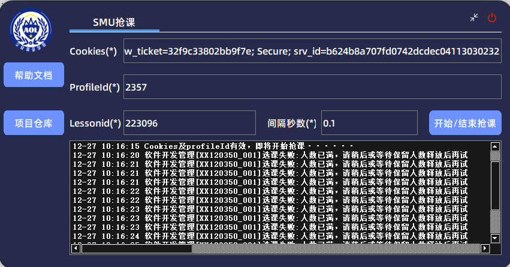
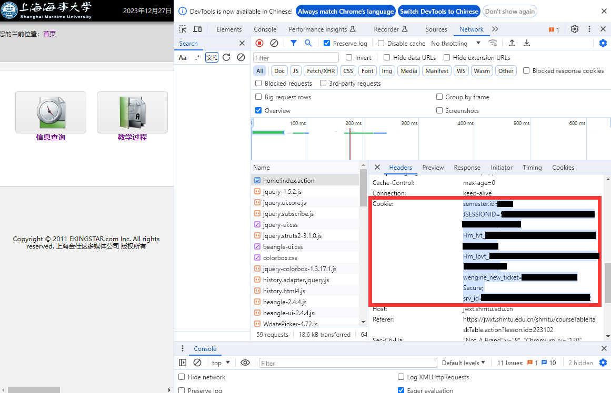
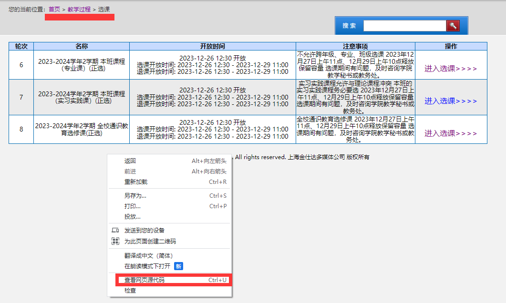
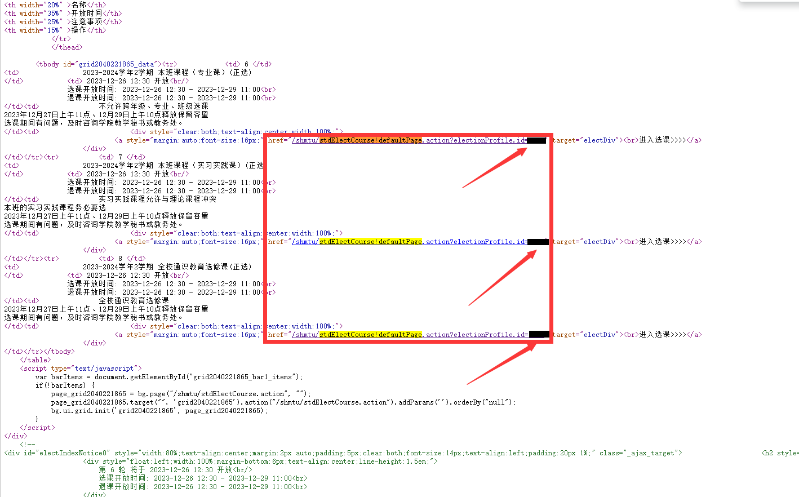
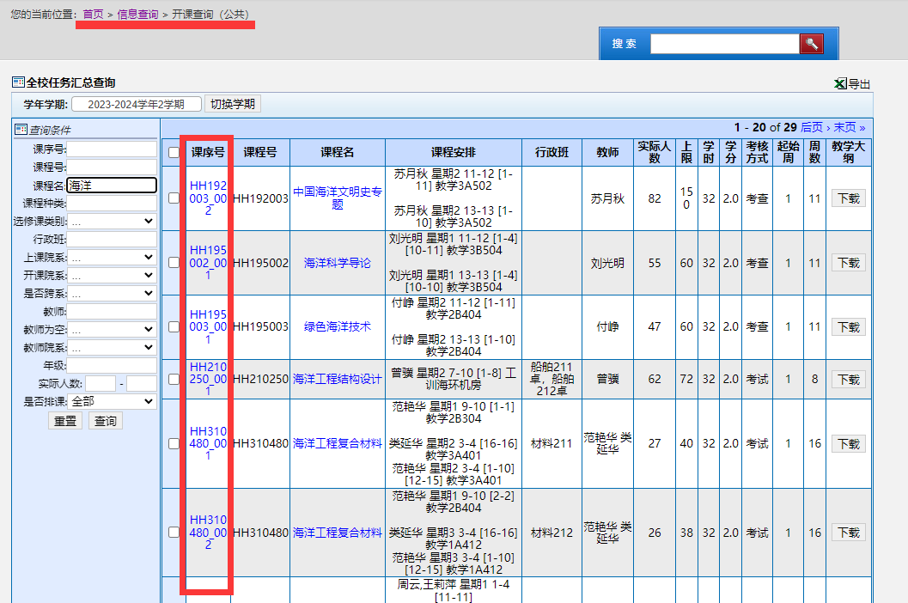
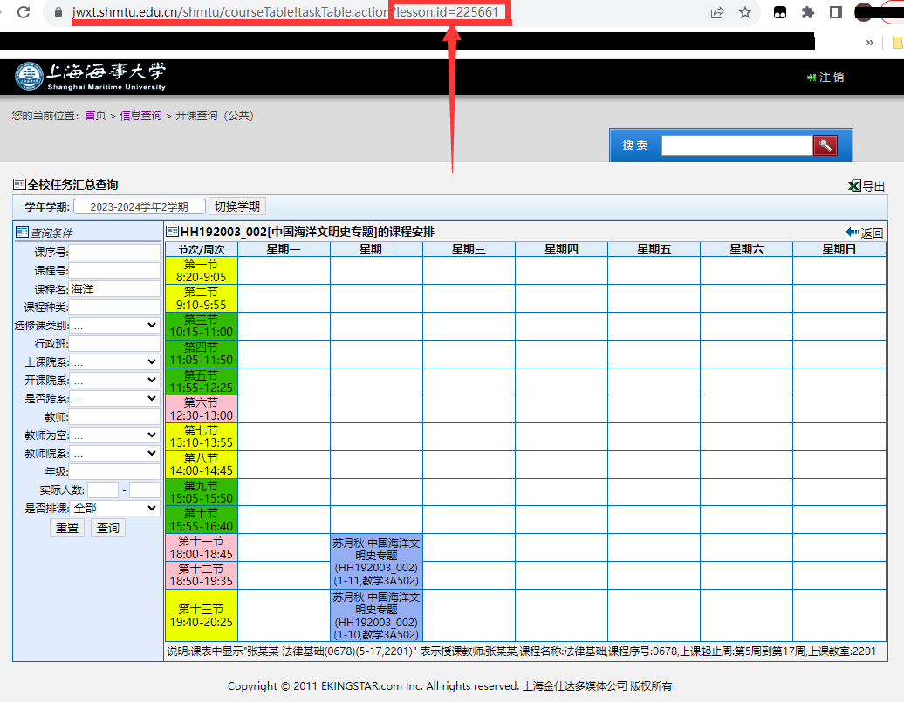

# smu_course_election_helper
Request实现的SHMTU教务系统抢课辅助软件

# 声明 Statement
本软件不得用于商业用途，仅供学习交流，切勿用于非法用途，对此产生的一切后果作者本人概不负责。

This project can not be used for commercial purposes, it is intended solely for learning and communication. Do not use it for illegal purposes. The author is not responsible for any consequences that arise from its use.
# 用法 Usage

打包好的exe安装包在release里，可以点击下方链接下载，直接安装使用

https://github.com/EricHongXDD/smu_course_election_helper/releases/download/V1.0/Smu.Course.Election.Helper_Setup_1.0.exe

## Cookies：登录SHMTU教务系统或数字平台获取到的Cookies

注意，获取到的Cookies需要全部复制进去，不是只有框里预留的三项

https://jwxt.shmtu.edu.cn

https://portal.shmtu.edu.cn

## ProfileId：选课课次ID

访问教务系统首页 > 教学过程 > 选课：https://jwxt.shmtu.edu.cn/shmtu/stdElectCourse.action

补退选开始前可以通过查看页面元素element（网页源代码），搜索stdElectCourse找到可用的ProfileId

选课开始后可点击操作中的进入选课>>>>得到当前页面链接

如https://jwxt.shmtu.edu.cn/shmtu/stdElectCourse!defaultPage.action?electionProfile.id=1234

则ProfileId=1234

## Lessonid：课程ID
 
访问教务系统首页 > 信息查询 > 开课查询（公共）：https://jwxt.shmtu.edu.cn/shmtu/teachTaskSearch.action

搜索到课程后，点击对应课程前方的课序号

点击后得到当前页面链接

得到的链接类似如：https://jwxt.shmtu.edu.cn/shmtu/courseTable!taskTable.action?lesson.id=212345

则Lessonid=212345

## 间隔秒数：

相邻两次请求发送的间隔时间，单位为秒（s），可接受float类型小数
